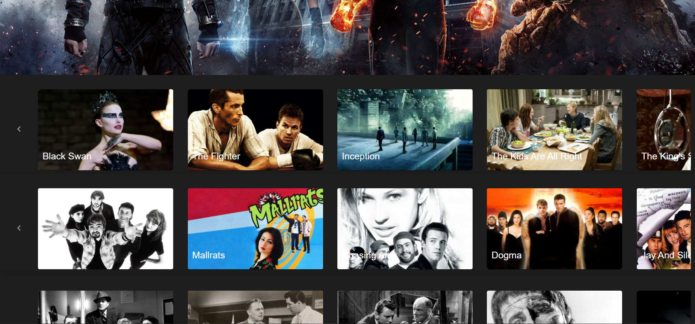

# VUEFLIX

####
Web app shows a summary of movies using this stack: 
- Vue js, 
- Nuxt, 
- Vuex, 
- Vuetify, 
- SASS.





# [DEMO](https://carolinaperezflores.github.io/vue-flix/ "DEMO")

## Problem Solved

In this project, the problem of overlaying styles in the image chart view zoom-in was solved.
The way it was solved was by changing the style classes to control the overflow property and allow the images to be contained in the carousel and slide without problems when the image is not being hovered over.

## Build Setup

```bash
# install dependencies
$ yarn install

# serve with hot reload at localhost:3000
$ yarn dev

# build for production and launch server
$ yarn build
$ yarn start

# generate static project
$ yarn generate
```

:fa-smile-o: